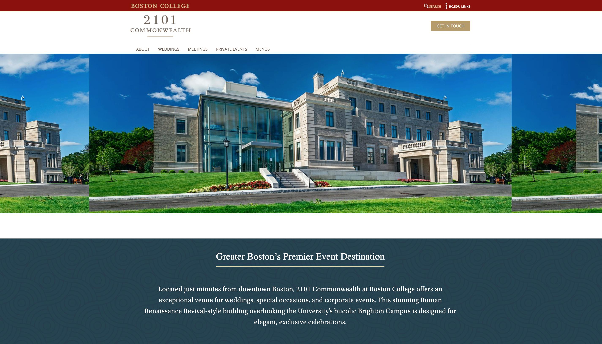
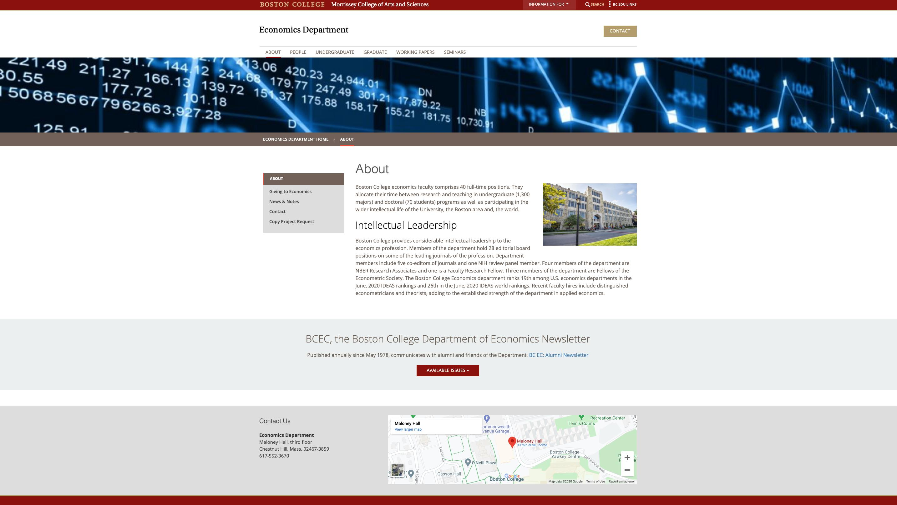
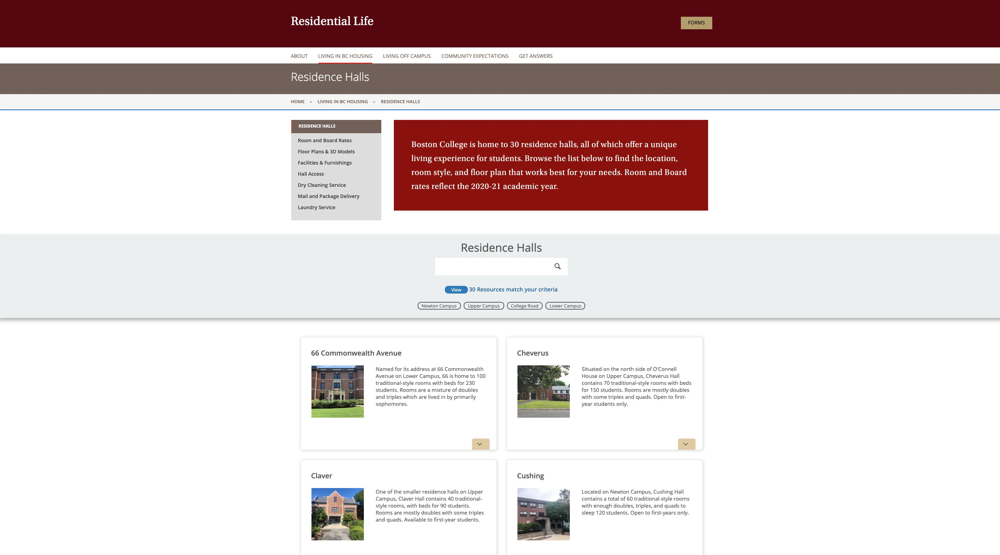
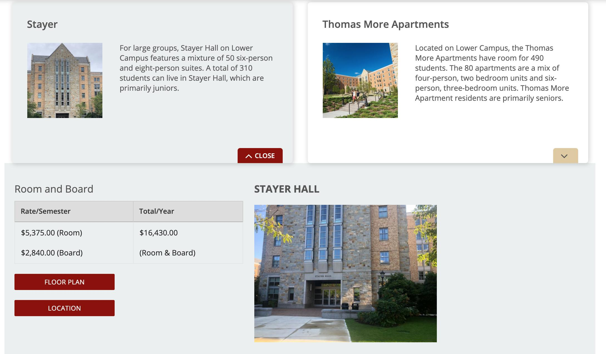

## About my Role

My role as a Web Communications Specialist involved helping in the large-scale transformation of Boston College's web presence that led to the redesign of over 96 websites. These websites included the eight schools, admissions office, academic departments, fitness center, and other offices.

Below you can view the work that I did such as designing the Information Architecture (IA) for a website and strategically laying out web content.

## Samples of my Work

1.  ### Landing Pages

    Below are one of the several landing pages that I assembled using Adobe Experience Manager.

    

    Check out the full website [here](https://www.bc.edu/content/bc-web/offices/auxiliary-services/sites/2101-commonwealth.html).

2.  ### Department Pages

    Next, are the webpages that the team and I designed for Academic Departments. Below you will observe the finished product for the Economics Department. You can check out the full site [here](https://www.bc.edu/content/bc-web/schools/mcas/departments/economics.html).

    

3.  ### Program Browser

    Another feature that exists on Boston College's Residential Life page is called the "Program Browser." I helped gather information, optimized images, and created tables in order for students to view housing options in an organized fashion.

    Below is the full screenshot of the webpage followed by a specific dorm where students can read the building description, view the pricing for room & board, and click either the floor plan button or the location button. The floor plan button will redirect students to learn more about the layout of dorm building, which requires them to login using their BC username and password. The location button redirects students to view the building on Google Maps.

    

     Students can select their specific dorm to read the building description, view the pricing for room & board, and click either the floor plan button or the location button. The floor plan button will redirect students to learn more about the layout of dorm building, which requires them to login using their BC username and password. The location button redirects students to view the building on Google Maps.

    

    To view the actual website click [here](https://www.bc.edu/bc-web/offices/student-affairs/sites/residential-life/living-in-bc-housing/bc-residence-halls.html).

I will continue to post more projects and tasks that I completed throughout my role as a Web Communications Specialist.
If you would like to see the guidelines that I followed when designing BC's websites visit [here](https://www.bc.edu/content/bc-web/styles/bc-web-style-guide.html).

